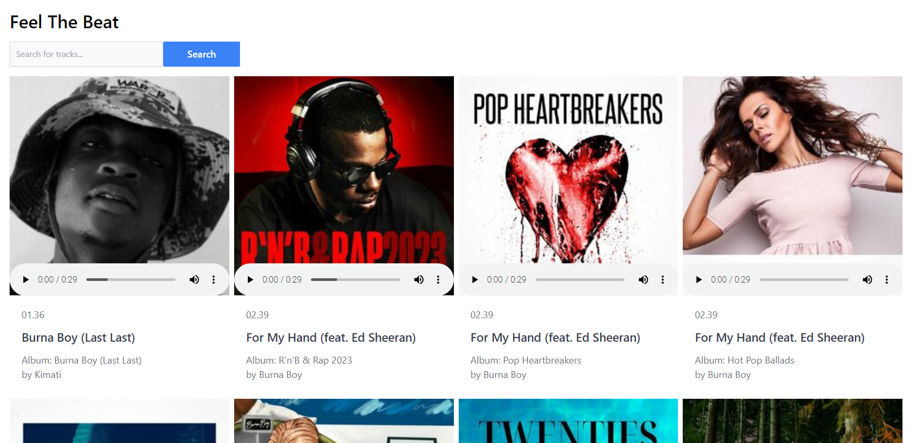
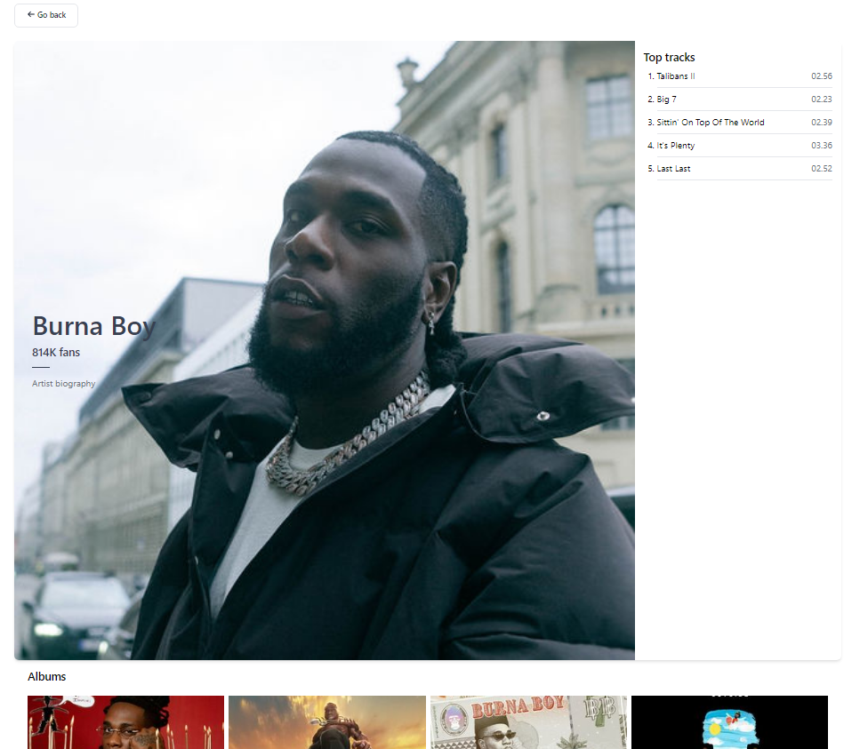

# Feel The Beat App

Feel The Beat is a music discovery application that allows users to search for artists, explore their top tracks and albums, and learn more about their favorite artists.

## Views

<p align="center">
  
</p>

<p align="center">
  
</p>

## Features

- Search for artists and view their top tracks and albums.
- Explore detailed artist profiles including biographies and fan counts.
- Listen to track previews and get album information.
- Responsive design for a seamless experience on different devices.

## Technologies Used

- React: Frontend JavaScript library for building user interfaces.
- Firebase: Backend-as-a-Service platform for hosting, authentication, and more.
- Express.js: Backend framework for building APIs and handling server logic.
- isomorphic-fetch: Library for making HTTP requests in the server-side environment.
- react-router-dom: Library for handling routing in the React application.

## Project Structure

The project is organized into the following main directories:

- `client`: Contains the React frontend application.
  - `src`: Houses the source code for the React application components, pages, and hooks.
- `functions``: Contains the Express.js backend server.
  - `src`: Contains the source code for the Express server and API endpoints.

## Getting Started

1. Clone the repository:
    ```
    git clone git@github.com:rOluochKe/feel-the-beat.git
    cd feel-the-beat
    ```
2. Install dependencies for the frontend and backend:
    ```
    cd client
    npm install
    npm start

    cd ../functions
    npm install
    npm run dev
    ```

## Contribution

Feel free to contribute to this project by submitting issues, pull requests, or new features. Please follow the project's coding standards and guidelines.
